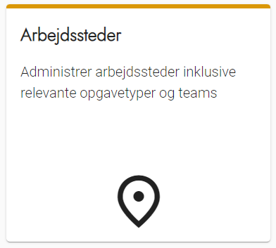
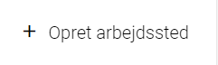
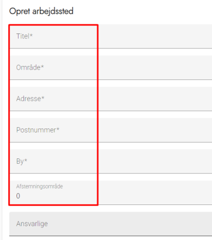
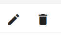

# Forklaring
Arbejdssteder kan både være valgsteder og andre steder, hvor du ønsker at få løst opgaver i løbet af valgets afvikling. Det er også her man tildeler valgsekretærer rettigheden som arbejdsstedsansvarlig.

OBS - Du kan med fordel oprette Opgavetyper og Teams, før du opretter arbejdssteder.

### Trin for trin

  
<strong>Trin 1: Administration af arbejdssteder</strong>

  <ol>
    <li>Vælge Administration i topmenuen</li>
    <li>Klikke på Arbejdssteder</li>
  </ol>

  

---

  
<strong>Trin 2: Opret arbejdssted og -ansvarlige</strong>

  <ol>
    <li>Vælg Opret arbejdssted øverst til højre</li>
    <li>
      Udfyld som minimum de obligatoriske *-markerede felter
      <ol>
        <li>
          Område anvendes ikke i alle valgkredse, se 
          <a href="omraader">vejledningen om denne</a>
        </li>
        <li>
          Afstemningsområde anvendes ved eksport til Valg Central, og udfyldes med samme afstemningsområde som i Valgcentral
        </li>
        <li>
          Ansvarlige kan udfyldes med den eller de valgsekretærer, der er ansvarlige for arbejdsstedet
        </li>
      </ol>
    </li>
    <li>
      Vælg de opgavetyper og teams, der er relevante for arbejdsstedet
      <ol>
        <li>
          Dette kan redigeres, så længe arbejdsstedet ikke er tilknyttet et aktivt valg
        </li>
      </ol>
    </li>
  </ol>

    

  

---

  
<strong>Trin 3: Rediger eller slet arbejdssted</strong>

  <ol>
      <li>Klik på Skraldespanden for at slette et arbejdssted</li>
      <li>KKlik på Blyanten ud for arbejdsstedet for at redigere oplysningerne</li>
  </ol>

<strong>OBS!</strong> Hvis du vil redigere tilknyttede teams og opgavetyper på et arbejdssted, er det kun muligt, hvis alle valg i OS2valghalla er deaktiverede. 

Læs mere om at <a href="valg">deaktivere et valg.</a> 

  

---