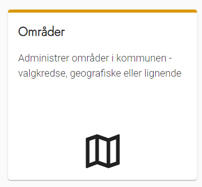
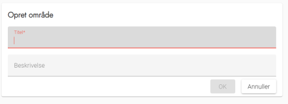
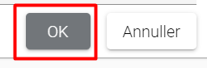

# Forklaring
Du har mulighed for at opdele arbejdsstederne i forskellige områder. Det er op til dig, om det skal være valgkredse, en geografisk opdeling eller noget helt andet. Dog skal der mindst være et område.

Hvis du ikke ønsker at opdele arbejdsstederne i flere områder, kan du nøjes med at have et enkelt område med kommunens navn - fx 'Korsbæk Kommune'.

Områder vises ikke på den eksterne hjemmeside, men benyttes til at opdele oversigten over opgaver i de valgte områder.

---

Trin for trin

  1. [Trin 1: Administration af Områder ](#administration)
  2. [Trin 2: Tilføj Område ](#tilføj)
  3. [Trin 3: Rediger eller slet område ](#slet)

## Administration

Fra forsiden skal du:

     1. Vælge Administration i topmenuen
     2. Klikke på Områder

Du står nu på siden administration af Områder

## Tilføj

 1. Klik på Opret område øverst til højre
     2. Udfyld navn og evt. beskrivelse
     3. Vælg OK for at gemme

## Slet

OS2valghalla kræver at der skal være oprettet mindst 1 område.

Hvis der ikke er behov for, at de personer der tilmelder sig skal kunne sortere på fx en geografisk opdeling af Arbejdsstederne, så anbefales det at redigere et af standardområderne og navngive det med kommunenavn eller valgkreds og herefter slette de øvrige områder.

     1. Klik på blyanten for at redigere Området
     2. Klik på skraldespanden for at slette Området

