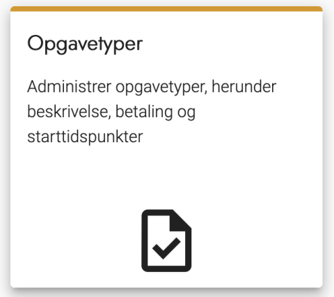
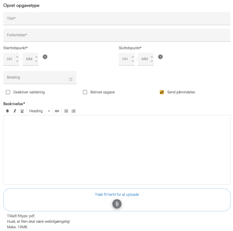

# Forklaring
Du skal benytte opgavetyperne til at definere de opgaver, der skal løses i forbindelse med valgafviklingen. Du kan også se dem som en rolle eller en funktion til valget. OS2valghalla indeholder nogle generelle opgavetyper:
- Brevstemmemodtager
- Fintæller
- Tilforordnet
- Valgsekretær
- Valgstyrer
- Valgstyrerformand

Disse kan redigeres eller slettes, som du ønsker.

Start- og sluttidspunkt defineres på den enkelte opgavetype, så hvis I fx arbejder med et dag- og et aftenhold, skal I oprette to opgavetyper med forskellige start- og sluttidspunkter. Tidspunkterne benyttes til at sikre, at en deltager ikke får overlappende opgaver.

### Trin for trin

 

  
<strong>Trin 1: Administration af Opgavetyper</strong>

Fra forsiden skal du:

<ol>
    <li>Vælge Administration i topmenuen</li>
    <li>Klikke på Opgavetyper</li>
</ol>

Du står nu på siden administration af Opgavetyper
  

---

  
<strong>Trin 2: Tilføj Opgavetype</strong>

<ol>
    <li>Klik på Opret opgavetype øverst til højre</li>
    <li>Udfyld Titel</li>
    <li>
        Udfyld Forkortelse
        <ol>
            <li>Denne benyttes til tabelvisninger af opgavestatus</li>
            <li>Der er ingen begrænsninger på antal tegn</li>
        </ol>
    </li>
    <li>Udfyld Starttidspunkt</li>
    <li>
        Udfyld Sluttidspunkt
        <ol>
            <li>Dette vises ikke på den eksterne hjemmeside</li>
            <li>Benyttes af systemet til at sikre, at en deltager ikke har overlappende opgaver</li>
            <li>Kan benyttes som token i beskedskabeloner</li>
        </ol>
    </li>
    <li>
        Udfyld Betaling
        <ol>
            <li>Hvis der ikke udbetales diæt eller honorar indtastes ingenting</li>
        </ol>
    </li>
    <li>Vælg Deaktiver validering, hvis opgavetypen ikke kræver at deltageren har stemmeret</li>
    <li>Vælg Betroet opgave, hvis opgaven ikke skal vises til alle teammedlemmer på den eksterne hjemmeside</li>
    <li>Vælg Send påmindelse, hvis der skal sendes en påmindelse om opgaven til deltageren 5 dage, før den skal løses</li>
    <li>
        Udfyld Beskrivelse
        <ol>
            <li>Denne vises på den eksterne hjemmeside og kan benyttes som token i beskedskabeloner</li>
        </ol>
    </li>
    <li>
        Upload fil
        <ol>
            <li>Denne fil vises under Mine opgaver på den eksterne hjemmeside, når en deltager er logget ind</li>
        </ol>
    </li>
    <li>Vælg OK for at gemme</li>
</ol>

---

  
<strong>Trin 3: Rediger eller slet Opgavetype</strong>

OS2valghalla har som standard en række opgavetyper. De kan redigeres eller slettes efter behov.

<ol>
    <li>Klik på blyanten for at redigere Opgavetypen</li>
    <li>Klik på skraldespanden for at slette Opgavetypen</li>
</ol>

