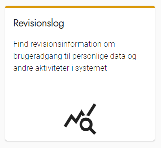
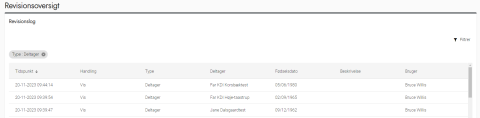
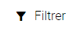
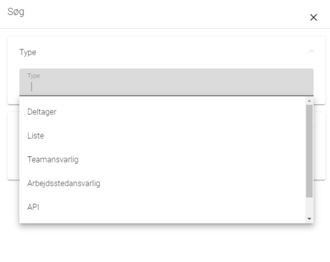

# Forklaring
I revisionsloggen (også kaldet audit log) kan du finde information om alle aktiviteter foretaget i systemet. Det gælder både handlinger knyttet til automatiske og manuelle processer.

Formålet med loggen er primært at undersøge, om brugere har tilgået personlige data. Derfor er filteret 'Deltager' aktiveret, når man går ind på siden, så disse aktiviteter vises som udgangspunkt.

Hvis du fjerner Deltager-filteret, vil du se mange handlinger. Fx registreres det hver gang en bruger logger ind eller får vist en side (det fremgår som en anmodning til API, hvor fx "/api/administration/area/queryarealisting" betyder, at en bruger har fået vist oversigten over områder). Denne del af revisionsloggen kan være svær at navigere i.

### Trin for trin

 

  
<strong>Trin 1: Brug af Revisionslog</strong>

Fra forsiden skal du:

<ol>
    <li>Vælge Administration i topmenuen</li>
    <li>Klikke på Revisionslog</li>
</ol>

---

  
<strong>Trin 2: Overblik</strong>

På overbliksbilledet kan du se de handlinger, der er foretaget ud fra det opsatte filter.

Som default er filteret sat til at vise handlinger på deltagere.

<ul>
    <li>Du kan fjerne filteremner ved at trykke på krydset ud for dem.</li>
    <li>Du kan sortere listen efter dato ved at trykke på tidspunkts-kolonnen.</li>
</ul>

---

  
<strong>Trin 3: Tilgå filteropsætning</strong>

Du kan tilgå filteropsætning ved at trykke på knappen Filtrer.

---

  
<strong>Trin 4: Opsæt filter</strong>

Du kan filtrere i to kategorier:

<ul>
    <li>Type</li>
    <li>Handling</li>
</ul>

I Type-kategorien kan du vælge følgende:

<ul>
    <li>Deltager</li>
    <li>Liste</li>
    <li>Teamansvarlig</li>
    <li>Arbejdsstedansvarlig</li>
    <li>API</li>
    <li>Andre</li>
</ul>

I Handlings-kategorien kan du vælge følgende:

<ul>
    <li>Opret</li>
    <li>Vis</li>
    <li>Rediger</li>
    <li>Slet</li>
    <li>Slå CPR op</li>
    <li>Generer</li>
    <li>Eksportér</li>
    <li>Anmod</li>
</ul>

Du kan vælge flere punkter fra begge kategorier og derved lave et meget præcist filter.

Når du har opsat det ønskede filter, skal du trykke <strong>Luk</strong>.

Du kan rydde filteret ved at trykke <strong>Ryd</strong>.

