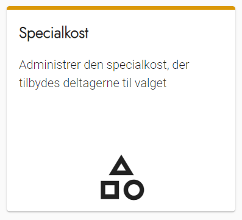
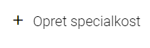
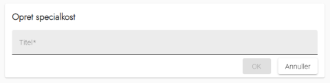

# Forklaring
Hvis kommunen tilbyder deltagerne specialkost, kan du indsamle og håndtere deres præferencer i
OS2valghalla. Systemet indeholder som udgangspunkt glutenfri eller vegetarisk kost, men du skal selvfølgelig konfigurere det efter, hvad I tilbyder.

Den oprettede specialkost vises som en valgmulighed ved oprettelse af en deltager, og når deltagerne selv opretter en profil.

### Trin for trin

 

  
<strong>Trin 1: Tilgå Specialkost </strong>

Fra forsiden skal du:

<ol>
    <li>Vælge Administration i topmenuen</li>
    <li>Klikke på Specialkost</li>
</ol>

---

  
<strong>Trin 2: Opret ny specialkost </strong>

For at tilføje yderligere typer af specialkost, skal du trykke på knappen <strong>Opret Specialkost</strong>

---

  
<strong>Trin 3: Navngiv specialkost</strong>

Giv specialkosten et sigende navn, det er ikke muligt at tilføje en beskrivelse.

Tryk herefter på <strong>OK</strong>

---

  
<strong>Trin 4: Rediger eller slet specialkost</strong>

Du kan ud for hvert punkt i overblikket redigere eller slette emnet, ved at trykke på henholdsvis blyant eller skraldespanden.

