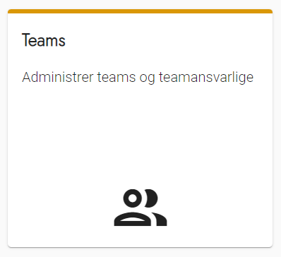
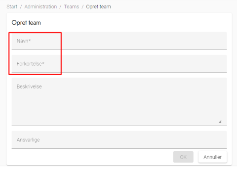
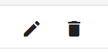

# Forklaring
Et team benyttes til at knytte deltagere og opgaver sammen. Et parti vil fx være et team, men det kan også være en afdeling i kommunen, som har til opgave at løse opgaver under valget.

OS2valghalla indeholder som udgangspunkt disse teams:
- Folketingets partier (2023)
- Eksempler på medarbejderteams: Borgerservice, IT-afdelingen og Medarbejdere
- 'Frivillige', der er tiltænkt opgaver til borgere, som ikke er tilknyttet et parti

Disse partier kan redigeres eller slettes.

Det er også på teams, du angiver, hvilke deltagere, der skal være teamansvarlige. Det vil oftest være partisekretærer eller den rekrutteringsansvarlige i en afdeling i kommunen.

##  Teams 

Teams er de grupper af personer der skal hjælpe ved valget. Det kan fx være partier, afdelinger eller frivillige borgere.

### Trin for trin

 

  
<strong>Trin 1: Administration af Teams</strong>

Fra forsiden skal du:

<ol>
    <li>Vælge Administration i topmenuen</li>
    <li>Klikke på Teams</li>
</ol>

---

  
<strong>Trin 2: Opret et team og teamansvarlige</strong>

<ol>
    <li>Vælg <strong>Opret Team</strong> øverst til højre</li>
    <li>Udfyld som minimum de obligatoriske *-markerede felter</li>
</ol>

Ansvarlige skal være tilmeldt som deltager for at kunne udpeges. Det anbefales derfor, at disse inviteres som de første, så de kan se teamets opgaver og invitere til opgaverne.

---

  
<strong>Trin 3: Rediger eller slet team</strong>

<ol>
    <li>Klik på Skraldespanden ud for teamet for at slette et Team</li>
    <li>Klik på Blyanten ud for teamet for at redigere et Team</li>
</ol>

---

  
<strong>Trin 4: Kopier invitationslink til et team</strong>

Det er muligt at invitere nye deltagere til et team. Via et link kan de selv oprette sig, og så bliver de automatisk tilknyttet teamet.

Find invitationslinket ved at følge denne guide:

<ol>
    <li>Klik på menupunktet <strong>Administration</strong></li>
    <li>Klik på <strong>Teams</strong></li>
    <li>Find det team, som partisekretæren skal være teamansvarlig for og klik på link-ikonet</li>
    <li>I den dialog, der åbner, skal du klikke på <strong>Kopier link til teamet</strong>-knappen</li>
    <li>Invitationslinket er nu gemt i din udklipsholder</li>
</ol>

