# Forklaring
Ved hjælp af et valg konfigureres de afgørende elementer i valgafviklingen:
- Valgtypen, som afgør hvordan det valideres om deltagerne må tage en opgave
- Hvilken periode kommunen skal have løst opgaver
- Valgdatoen
- Låseperiode
- Hvilke arbejdssteder, der skal løses opgaver på
- Kommunikationskonfiguration
- Aktivering/deaktivering

# Vigtigt om redigering af et valg
Bemærk at man ikke kan redigere valgtype, datointerval og valgdato samt fjerne arbejdssteder på et
eksisterende valg. Det skyldes stor kompleksitet i sammenhængen mellem disse elementer og fordelingen af opgaver i valget.

Hvis du har behov for at redigere disse elementer anbefaler vi, at du duplikerer det eksisterende valg og ændrer det nødvendige på den nye kopi.

### Trin for trin

 

  
<strong>Trin 1: Administration af valg</strong>

  
Fra forsiden skal du:

  <ol>
    <li>Vælge Administration i topmenuen</li>
    <li>Klikke på Valg</li>
  </ol>
  
Du står nu på valgoverblikket.
 br
  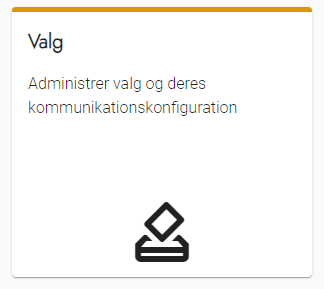

---

  
<strong>Trin 2: Valgoverblikket</strong>

  
På denne side har du en oversigt over alle valg i din løsning, både aktive og inaktive.

  
Du har også mulighed for at:

  <ol>
    <li>Oprette nye valg</li>
    <li>Redigere eksisterende valg</li>
    <li>Redigere kommunikationskonfiguration på eksisterende valg</li>
    <li>Duplikere valg</li>
    <li>Slette valg</li>
  </ol>
  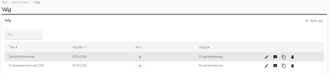

---

  
<strong>Trin 3: Opret valg</strong>

  
Når du skal oprette et nyt valg skal du trykke på knappen opret valg
  
  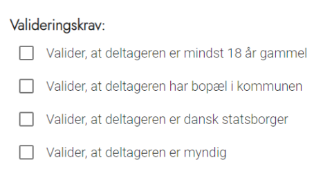

  

    
<strong>Trin 3.1: Titel og Type</strong>

    
På første trin skal du opsætte de første grundlæggende indstillinger for et valg:

    <ol>
      <li>En titel på valget. F.eks. EU-parlamentsvalg 2024</li>
      <li>Vælge en valgtype</li>
      <li>Angive en låseperiode</li>
    </ol>
    
Valgtypen afgør, hvilken validering der kan foretages af deltagerne. Som udgangspunkt er OS2valghalla sat op efter lovens bestemmelser, men du kan også selv ændre i valideringen under administration af <a href="valgtyper">Valgtyper</a>.

    
Låseperioden angiver det tidsrum før valgdatoen, hvor deltagere ikke længere selv kan afmelde sig opgaver. I det tidsrum skal de kontakte den valgansvarlige, hvilket de oplyses om.
  
    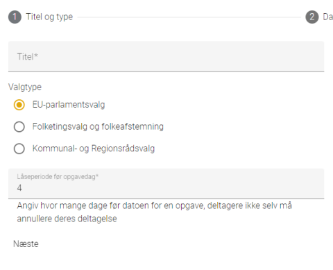
  

  

    
<strong>Trin 3.2: Datoer</strong>

    
På andet trin skal du opsætte datoer:

    <ol>
      <li>Opsætte datointerval fra første dato til sidste dato du skal bemande arbejdspladser</li>
      <li>Vælge en valgdato</li>
    </ol>
    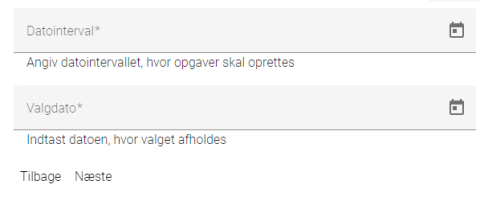
  

  

    
<strong>Trin 3.3: Arbejdssteder</strong>

    
På tredje trin skal du vælge de arbejdssteder, du skal bemande. Du opsætter, hvilke arbejdssteder der skal fremgå på listen under administration af <a href="arbejdssteder">Arbejdssteder</a>.
  
    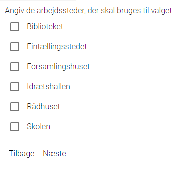
  

  

    
<strong>Trin 3.4: Kommunikation</strong>

    
På sidste trin skal du opsætte kommunikation for valget. Du skal først vælge skabeloner til standardbeskeder. Disse skabeloner bruges til alt kommunikation, som ikke bliver styret af opgavespecifik opsætning.

    
Du kan have tre typer af skabeloner - Digital Post, E-mail eller SMS. Det er vigtigt, du har opsat de rigtige typer af skabeloner i skabelonadministrationen. Du opsætter skabelonerne under administration af <a href="../kommunikation/beskedskabeloner">Beskedskabeloner</a>.

    
Når du har udfyldt de fire trin, vil det være muligt at trykke på OK, og valget bliver nu oprettet. Bemærk at du kan redigere opsætningen af kommunikation senere.
  
    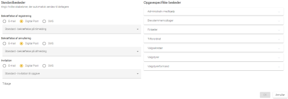
  

---

  
<strong>Trin 4: Aktivér og deaktivér valg</strong>

  
Når et valg aktiveres, sker der to ting:

  <ol>
    <li>Mere funktionalitet aktiveres på den eksterne hjemmeside, så deltagerne kan få adgang til opgaver og logge ind.
      <ol>
        <li>Funktioner til team- og arbejdsstedsansvarlige bliver også tilgængelige</li>
      </ol>
    </li>
    <li>Der udsendes automatisk invitationer til de deltagere, som er blevet tildelt en opgave
      <ol>
        <li>Bemærk at der udsendes en bekræftelse i stedet for en invitation, hvis du allerede har svaret ja på vegne af en deltager</li>
      </ol>
    </li>
  </ol>
  
Der udsendes ikke automatiske beskeder fra et deaktiveret valg.

  
<strong>OBS!</strong> Automatiske beskeder udsendes ikke igen, hvis man deaktiverer et igangværende valg og aktiverer det igen. Systemet registrerer, at de allerede er sendt.

  

    
<strong>Trin 4.1: Aktivér valg</strong>

    
Klik på det røde kryds ud for det valg, som du ønsker at aktivere

    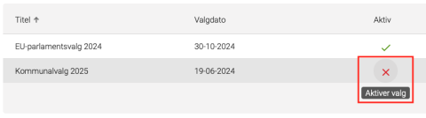
  

  

    
<strong>Trin 4.2: Deaktivér valg</strong>

    
Klik på det grønne flueben kryds ud for det valg, som du ønsker at deaktivere
  
    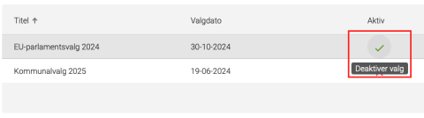
  

---

  
<strong>Trin 5: Skifte valg</strong>

  
Du kan skifte mellem de oprettede valg. Bemærk at de fleste data i OS2valghalla gælder på tværs af valg. Det drejer sig om:

  <ul>
    <li>Grundlæggende oplysninger konfigureret under menupunktet Administration</li>
    <li>Deltagere</li>
    <li>Beskedskabeloner</li>
  </ul>
  
Ved at skifte mellem valg skiftes følgende elementer:

  <ul>
    <li>Opgaver, som er tilknyttet det valgte valg</li>
    <li>Potentielle modtagere af <a href="../kommunikation/send_besked">manuelt udsendte beskeder</a></li>
    <li>Oplysninger, som kan eksporteres under menupunktet <a href="../../vejledninger/lister">Lister</a></li>
  </ul>
  
Sådan skifter du:

  <ol>
    <li>Scroll ned i bunden af siden</li>
    <li>Klik på "Skift valg"</li>
    <li>Vælg det ønskede valg i den dialog, som vises</li>
    <li>Klik OK</li>
  </ol>
  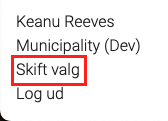

---

  
<strong>Trin 6: Duplikere valg</strong>

  
Du kan duplikere et tidligere valg fra valgoverblikket. Klik på kopi-ikonet ud for det valg, som du ønsker at duplikere.
 
  
Ved duplikering er det muligt at ændre på alle parametre fra det tidligere valg som fx valgperiode, valgdato og tilknyttede arbejdssteder.
 
  
Når et valg duplikeres, overføres opgavefordelingen på de tilknyttede valgsteder. Deltagernes placering på opgaverne vil dog ikke blive overført.
  
  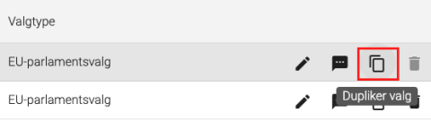

  

    
<strong>Trin 6.1: Duplikeret data</strong>

    
Disse oplysninger duplikeres 1:1 fra det oprindelige til det nye valg:
 
    <ul>
      <li>Titel</li>
      <li>Valgtype</li>
      <li>Låseperiode</li>
      <li>Arbejdssteder</li>
      <li>Kommunikationskonfiguration</li>
      <li>Opgavefordeling på arbejdssteder</li>
    </ul>
    
Alle oplysninger kan redigeres under duplikationen.
 

    
Datointervallet konverteres til antal dage:
 
    
For at sikre at opgavefordelingen duplikeres korrekt, kan systemet ikke duplikere datointervallet baseret på datoer. I stedet angives hvor mange dage før og efter valget, der skal løses opgaver.
 

    
Disse oplysninger duplikeres ikke:

    <ul>
      <li>Valgdato</li>
      <li>Deltageres placering på opgaver - det er altså kun opgavefordelingen, der duplikeres.</li>
    </ul>
    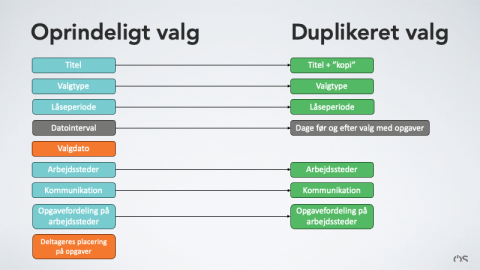
  

---

  
<strong>Trin 7: Slette et valg</strong>

  
Du kan slette et deaktiveret valg efter behov. Sammen med valget slettes fordelingen af opgaver på de tilknyttede arbejdssteder. Desuden slettes deltagernes tilknytning til opgaver i valget, så det kan være en god idé at eksportere en liste med oplysningerne inden valget slettes.
 
  
Hvis du har behov for at gemme opgavefordelingen, kan du duplikere valget, inden du sletter det.

  <ol>
    <li>Gå til valgoverblikket</li>
    <li>Klik på skraldespandsikonet ud for det valg, som du ønsker at slette</li>
    <li>Klik OK i den dialog som vises.</li>
  </ol>
  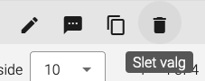

---

  
<strong>Trin 8: Redigere kommunikationskonfiguration</strong>

  
  
Det er muligt at ændre konfigurationen af, hvilke beskedskabeloner der benyttes i et valg, og om de udsendes med Digital Post, E-mail eller SMS.

  <ol>
    <li>Gå til valgoverblikket</li>
    <li>Klik på talebobleikonet ud for det valg, som du vil ændre kommunikationskonfigurationen på</li>
    <li>I kolonnen <strong>Standardbeskeder</strong> opsættes de beskeder, der udsendes som standard på tværs af opgavetyper</li>
    <li>I kolonnen <strong>Opgavespecifikke beskeder</strong> kan du lave undtagelser til standarden
      <ol>
        <li>Det er fx muligt at opsætte medarbejder-rettede opgavetyper til at udsende beskeder via E-mail. Bemærk at det kræver en beskedskabelon af typen E-mail.</li>
      </ol>
    </li>
    <li>Lav de ændringer, som du ønsker</li>
    <li>Klik på OK</li>
  </ol>
  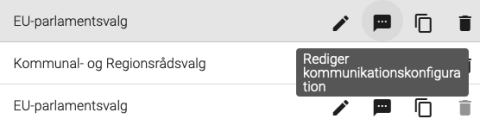

