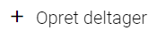
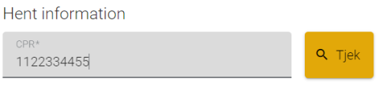
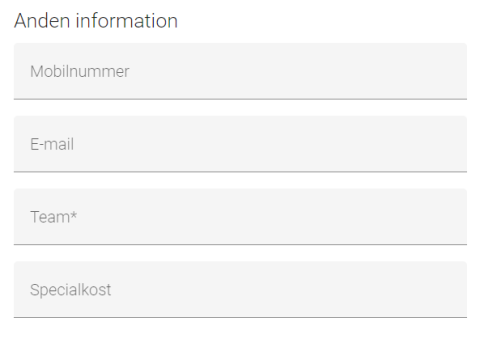
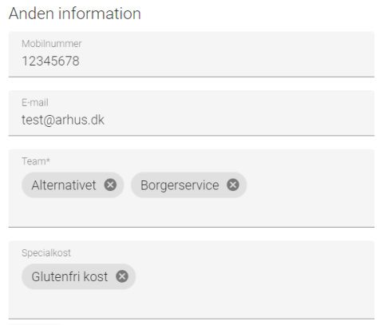
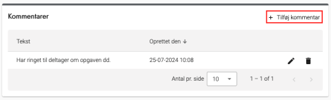
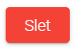
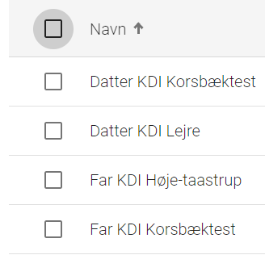
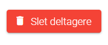

# Forklaring
Under menupunktet 'Deltagere' finder du en liste over alle oprettede deltagere i OS2valghalla. Listen indeholder alle deltagere på tværs af alle valg. Visningen er altså ikke afgrænset til det valg, du aktivt arbejder med.

Du kan med fordel bruge søgefunktion og filterfunktion til at navigere i deltagerlisten.

---

Du har disse muligheder for at administrere deltagere:

  
<strong>Trin 1: Opret deltager</strong>
 

  

    
<strong>Trin 1.1: Opret deltager</strong>

    
Tryk på Opret deltager

     

  

  

    
<strong>Trin 1.2: Hent fra CPR</strong>

    
Indtast CPR nummer på deltageren og tryk Tjek

    
Dette henter informationer fra CPR og udfylder højre side af skærmen.

     
  

  

    
<strong>Trin 1.3: Tilføj anden information</strong>

    
Efter CPR opslaget kan du udfylde anden information om deltageren.

    <ul>
      <li>Mobiltelefon</li>
      <li>Email</li>
      <li>Team (obligatorisk, en deltager kan godt have flere teams)</li>
      <li>Specialkost (kan godt have flere valg af specialkost)</li>
    </ul>
    
Når disse er udfyldt, skal du trykke OK og deltageren er nu oprettet.

     
  

 

  
<strong>Trin 2: Se alle oplysninger om en deltager</strong>

  
Ved at trykke på en deltagers navn kan du se alle oplysninger om en deltager:

  <ul>
    <li>Information
      <ul>
        <li>Navn, adresse og kontaktoplysninger</li>
      </ul>
    </li>
    <li>Valideringsoplysninger
      <ul>
        <li>Alder, kommune, statsborgerskab, myndig, levende og valideringsdato</li>
      </ul>
    </li>
    <li>Om deltager er team- eller arbejdsstedsansvarlig</li>
    <li>Kommentarer</li>
    <li>Opgavestatus</li>
    <li>Kommunikationslog</li>
  </ul>

 

  
<strong>Trin 3: Rediger deltager</strong>
 

  

    
<strong>Trin 3.1: Rediger deltager</strong>

    
Tryk på redigerknappen ud fra den deltager du skal ændre på.

     
  

  

    
<strong>Trin 3.2: Opdatering af information</strong>

    
Når du har lavet de ønskede ændringer, skal du trykke på OK knappen.

     
  

 

  
<strong>Trin 4: Tilføj kommentar til deltager</strong>

  <ol>
    <li>Gå til deltagerens profil ved at klikke på deltagerens navn på oversigten</li>
    <li>Klik på knappen Tilføj kommentar</li>
    <li>Skriv din kommentar i det vindue, der åbner</li>
    <li>Klik på OK</li>
    <li>Kommentar gemmes med dato og klokkeslæt</li>
    <li>Du kan redigere kommentarer ved at klikke på blyantsikonet</li>
    <li>Du kan slette kommentarer ved at klikke på skraldespandsikonet</li>
  </ol>

   

 

  
<strong>Trin 5: Slet deltager</strong>
 

  

    
<strong>Trin 5.1: Slet deltager</strong>

    
Tryk på redigerknappen ud for den deltager du skal slette.

     
  

  

    
<strong>Trin 5.2: Slet</strong>

    
Tryk på Slet knappen under Anden information.

     
  

 

  
<strong>Trin 6: Slet flere eller alle deltagere</strong>
 

  

    
<strong>Trin 6.1: Marker flere eller alle</strong>

    
I venstre side af overbliksbilledet kan du vælge en deltager af gangen ved at markere boksen ud for navnet.

    
Du kan også vælge alle deltagere ved at markere boksen øverst i toppen af overbliksbilledet. Bemærk at du derved også markerer deltagere, som findes på efterfølgende sider i tabellen.

     
  

  

    
<strong>Trin 6.2: Slet</strong>

    
Når du har markeret de deltagere, du vil slette, skal du trykke på knappen Slet deltagere.

    
Følg derefter instruktionerne, som sikrer, at du ikke sletter deltagere ved en fejl.

     
  

