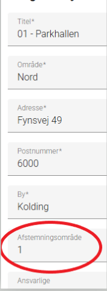
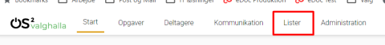
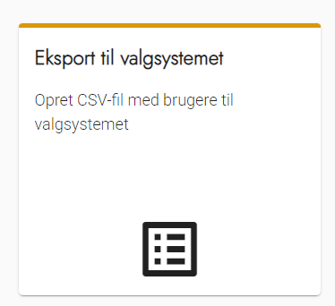
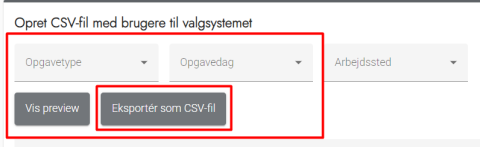
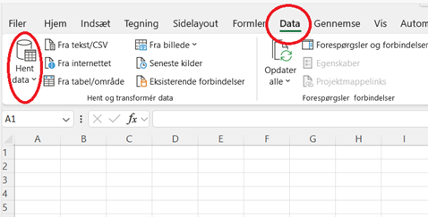
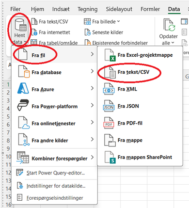
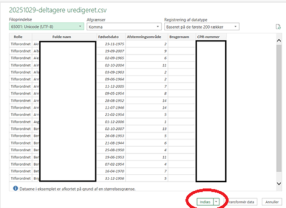
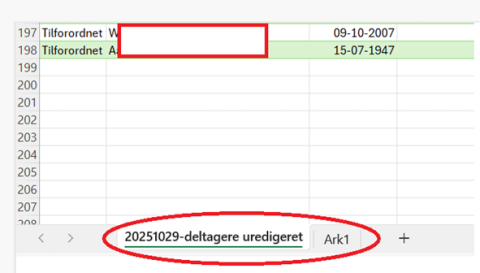
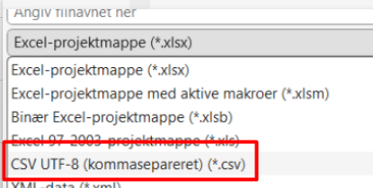

# Export af deltagere fra Valghalla

  
<strong>Trin 1: Husk at dine arbejdssteder skal have et afstemningsområde</strong>

  
I Valg Central har alle afstemningsområder et fortløbende nummer. Dette nummer skal fremgå af arbejdsstedet i Valghalla, så Valg Central ved hvilke afstemningsområde deltagerne skal oprettes på.

  
Se eventuelt her hvordan du opretter og redigerer dine arbejdssteder i Valghalla: <a href="../administration/arbejdssteder">Klik her</a>

  

 

  
<strong>Trin 2: Vælg Lister i Topmenu</strong>

  
Klik på Lister i menuen i toppen af Valghalla

  

 

  
<strong>Trin 3: Vælg Eksport til valgsystemet</strong>

  
Klik på Eksport til valgsystemet

  

 

  
<strong>Trin 4: Vælg hvilke deltagere der skal eksporteres</strong>

  
Vælg ved hjælp af valglisterne Opgavetype, Opgavedag og Arbejdssted hvilke deltagere i Valghalla der skal eksporteres til Valg Central.

  
Brug Vis preview til at se resultatet.

  
Vælg Eksporter som CSV-fil når du er tilfreds med dit udtræk.

  
Filen gemmes automatisk på din PC i overførselsmappen.

  
Husk at Valgsekretærer skal indgå i listen, da de ellers ikke kan tilgå Valg-Lokal på valgdagen.

  

 

  
<strong>Trin 5: Klargør filen til import i Valg Central</strong>

  <!-- #ecfa9d -->
  <!-- #ffb0e5 -->
  <!-- <mark>OBS, gul highlight</mark> -->

  
OBS vær opmærksom på at opgaverne fra Valghalla skal ændres så de passer til Valg Central

  
Valg Central overskriver data når du importere dem, så listen skal indeholde alle de deltagere der skal anvende Valg Lokal når du importerer dem.

  

    
<strong>Trin 5.1: Klargør ny fil til import i Valg Central trin 1</strong>

    <ol>
      <li>Åben et nyt tomt regneark</li>
      <li>Klik på <strong>Data</strong> i topmenuen</li>
      <li>Vælg <strong>Hent data</strong></li>
      <li>Vælg <strong>Fra fil</strong> og herefter <strong>Fra tekst/csv</strong></li>
      <li>Vælg filen som Valghalla har gemt i din mappe Overførsler på din PC</li>
    </ol>
     
    
  
 

  

    
<strong>Trin 5.2: Klargør ny fil til import i Valg Central trin 2</strong>

    <ol>
      <li>I det vindue der kommer frem vælger du <strong>Indlæs</strong></li>
      <li>Nu kommer filen frem på din skærm – vær OBS på om der automatisk oprettes 2 ark – hvis der gør skal du slette <strong>Ark 1</strong> (højreklik og vælg slet)</li>
    </ol>
     
    
  
 

  

    
<strong>Trin 5.3: Omdøb dine opgavetyper så de passer til Valg Central</strong>

    
Importen til Valg Central <strong>må kun indeholde rollerne Valgsekretær og Tilforordnet.</strong>

    
Hvis du har brugt andre opgavetyper i Valghalla <strong>skal</strong> du derfor tilrette rollerne i kolonne A, så de passer til kravet fra Valg Central.

    
Hvis du har Valgstyrere på listen skal disse omdøbes til Tilforordnet.

  

  

    
<strong>Trin 5.4: Gem filen inden import til Valg Central</strong>

    
Når du har tilrettet filen skal du gemme den som CSV UTF-8 (kommasepareret).

    
Vælg <strong>Gem Som</strong> og derefter den korrekte filtype.

    
  

