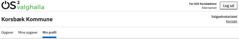
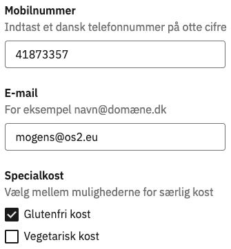
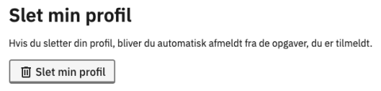
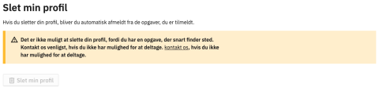

# Forklaring
Ved hjælp af menupunktet 'Min profil' har deltagere mulighed for at se, tilrette og slette deres egen profil. Dette inkluderer mobilnummer, e-mail og specialkost.

Muligheden for at slette sin egen profil gælder kun, så længe låseperioden ikke er aktiv. Herefter henvises deltageren til at kontakte valgsekretariatet for at blive slettet.

### Trin for trin

  
<strong>Trin 1: Find 'Min profil'</strong>

  
Når en deltager er logget ind på den eksterne hjemmeside, bliver menupunktet 'Min profil' synligt.

  

 

  
<strong>Trin 2: Redigér oplysninger</strong>

  
Deltagerens stamoplysninger hentes fra CPR-registret og opdateres derfra en gang i ugen, når der er et aktivt valg. Disse kan altså ikke redigeres.

  
  <ol>
    <li>Rediger mobilnummer i feltet</li>
    <li>Rediger e-mailadresse i feltet</li>
    <li>Afkryds de muligheder for specialkost, som kommunen tilbyder</li>
    <li>Klik på Gem-knappen
       
      
    </li>
  </ol>

br

  
<strong>Trin 3: Slet profil</strong>

  
  <ol>
    <li>Klik på Slet min profil-knappen</li>
    <li>Du bliver bedt om at bekræfte, da de automatisk også fjernes fra tilmeldte opgaver
      <ol>
        <li>Klik på Ja, slet min profil</li>
      </ol>
    </li>
    <li>Din profil bliver nu slettet og du logges ud af systemet
      
Hvis låseperioden er aktiv, vil deltagere ikke længere selv kunne slette deres profil. De får vist besked om dette inkl. kontaktoplysninger, så de kan henvende sig til Valgsekretariatet.

       
      
    </li>
  </ol>

