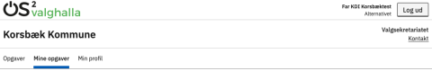
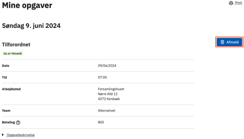
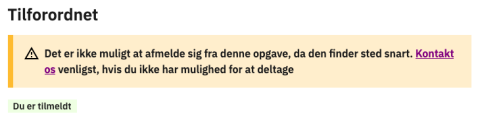

# Forklaring
Ved hjælp af menupunktet 'Mine opgaver' har deltagere mulighed for at finde de(n) opgave(r), de er tilmeldt.
For hver opgave vises detaljer samt PDF-guide, hvis denne er uploadet på opgavetypen. <!-- link til opgavetyper -->

Deltagere har mulighed for at afmelde sig fra en opgave, så længe låseperioden på valget ikke er aktiv.
Herefter henvises deltageren til at kontakte valgsekretariatet for at blive afmeldt.

### Trin for trin

 

  
<strong>Trin 1: Find 'Mine opgaver'</strong>

  
Når en deltager er logget ind på den eksterne hjemmeside, bliver menupunktet 'Mine opgaver' synligt.

  

  
<strong>Trin 2: Afmelding fra opgave</strong>

  
Hvis deltagere alligevel ikke kan tage en opgave eller gerne vil skifte til en anden opgave, kan de selv afmelde sig tilmeldte opgaver:

  <ol>
    <li>Find den opgave, der skal afmeldes</li>
    <li>Klik på Afmeld-knappen</li>
    <li>Du bliver bedt om at bekræfte afmeldingen - klik på Afmeld-knappen</li>
    <li>Der vises en bekræftelse på afmelding og opgaven forsvinder fra 'Mine opgaver'</li>
  </ol>
  
Hvis låseperioden er aktiv, vil deltagere ikke længere selv kunne afmelde sig fra opgaver. De får vist besked om dette inkl. kontaktoplysninger, så de kan henvende sig til Valgsekretariatet.

  
  

