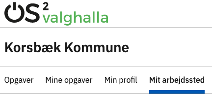
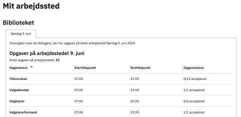
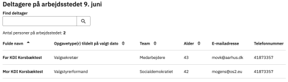

# Forklaring
Under menupunktet Mit arbejdssted kan man se en oversigt over de tildelte opgaver på et arbejdssted.
Desuden er der en oversigt over de deltagere, som er tildelt opgaver på arbejdsstedet og deres kontaktoplysninger. Begge dele kan ses for alle datoer, hvor der er opgaver på arbejdsstedet.

En arbejdsstedsansvarlig har ikke mulighed for at tildele deltagere til opgaver eller fjerne dem fra dem.

Denne funktion er særligt tiltænkt valgsekretærer, der er ansvarlige for et valgsted.

### Menupunktet Mit arbejdssted 

**OBS!**

Menupunktet 'Mit arbejdssted' er kun tilgængeligt for deltagere, der har fået [tildelt rettigheder som arbejdsstedsansvarlig](../administration/arbejdssteder).

  
<strong>Trin 1: Find 'Mit arbejdssted'</strong>

  
Når en bruger med rettigheden arbejdsstedsansvarlig er logget ind på den eksterne hjemmeside, bliver menupunktet Mit arbejdssted synligt.

  

 

  
<strong>Trin 2: Se opgaveoversigt og status</strong>

  
Som det første kan du se en oversigt over alle oprettede opgaver på arbejdsstedet.

  
Der vises, hvilke typer af opgaver, der skal løses, og hvornår de starter og slutter. Bemærk at sluttidspunktet kan være misvisende, da OS2valghalla ikke understøtter, at en opgave kan strække sig over midnat.

  
Du kan også se en status over, hvor mange deltagere der har accepteret opgaverne.

  

 

  
<strong>Trin 3: Se deltagerne og deres kontaktoplysninger</strong>

  
Nederst på siden kan du finde en liste over de deltagere, som skal løse opgaver.

  
Du kan også se, hvilket parti eller team de er på, deres alder og deres kontaktoplysninger.

  
Benyt søgefeltet til at søge på navnet på en deltager.

  

