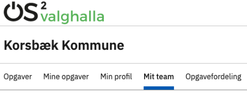
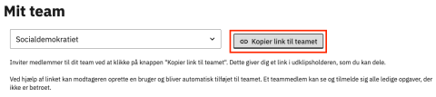
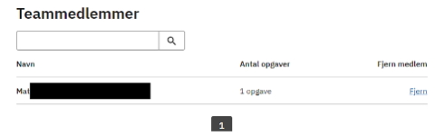

# Forklaring
Her kan teamansvarlige (fx en partisekretær) invitere nye medlemmer til teamet samt se en oversigt alle teammedlemmer.

Den teamansvarlige kan desuden fjerne en deltager fra et team. Dette er dog blokeret, hvis låseperioden er aktiv for en opgave tilknyttet en deltager, eller hvis deltageren har haft en opgave ved et tidligere valg.

  
<strong>Trin 1: Find 'Mit team'</strong>

  
Når en bruger med rettigheden teamansvarlig er logget ind på den eksterne hjemmeside, bliver menupunktet Mit team synligt.

  

 

  
<strong>Trin 2: Invitér deltagere til teamet</strong>

  
Under Mit team kan du kopiere et link, som benyttes til at invitere nye deltagere til at blive medlem af det pågældende team.

  
Når de benytter det til at oprette sig i systemet, kan de melde sig til teamets ikke-betroede opgaver.

  
Når medlemmerne klikker på linket, ser de en invitation til at blive medlem af teamet. Herefter skal de logge ind med MitID og oprette en profil. Derefter kan de se de opgaver, der er ledige. Herefter kan de trykke tilmeld på den opgave, de gerne vil tilmelde sig.

  

  

    
<strong>Trin 2.1: Forskellige opgavetyper</strong>

    
I relation til dette er det vigtigt at huske, at der er to kategorier af opgaver i OS2valghalla:

    <ul>
      <li><strong>Ikke-betroede opgaver:</strong> Opgaver som alle kan tilmelde sig, hvis de melder sig ind i et team. Det er typisk opgaven som tilforordnet, der er en ikke-betroet opgave.</li>
      <li><strong>Betroede opgaver:</strong> Opgaver som kræver, at du bliver inviteret specifikt til at påtage dig denne opgave. Det vil fx typisk være opgaven som valgstyrerformand.</li>
    </ul>
  

 

  
<strong>Trin 3: Se teamets medlemmer</strong>

  
Du kan også se, hvem der har meldt sig til at deltage.

  
Det er desværre ikke muligt at se, hvilken opgave personerne har taget, men det arbejder vi på bliver muligt.

  
Som teamansvarlig har du også mulighed for at fjerne et medlem. Hvis du gør dette, får personen besked om, at de er blevet fjernet, og opgaven bliver ledig. Bemærk at en administrator kan blokere for, at det er muligt.

  

