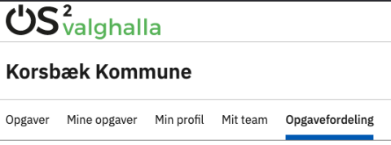
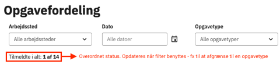
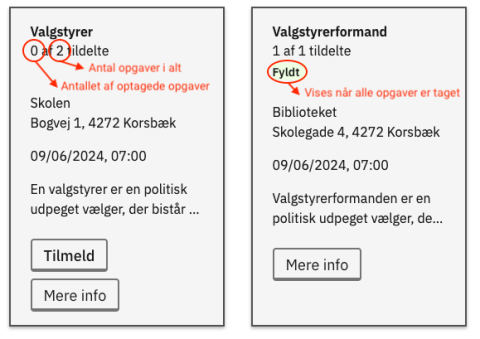
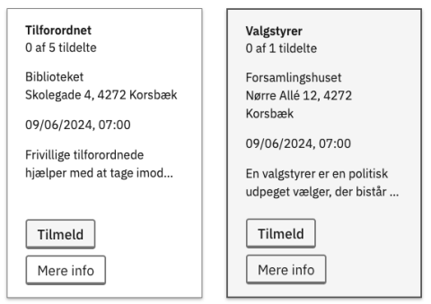
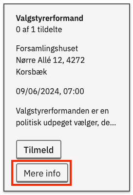
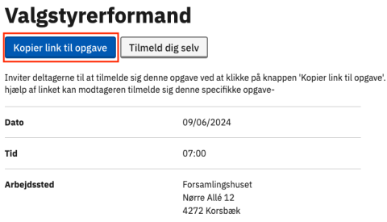

# Forklaring
Her kan den teamansvarlige (fx en partisekretær) se en oversigt over alle opgaver, som er tildelt til teamet - både betroede og ikke-betroede.

Den teamansvarlige kan desuden finde og kopiere et link til de enkelte opgaver. Linket kan derefter deles via mail eller lignende med dem, der skal have den specifikke opgave.

Det er ikke muligt for teamansvarlige at tildele en opgave direkte til en deltager.

### Menupunktet Opgavefordeling 

**OBS!**

Menupunktet 'Opgavefordeling' er kun tilgængeligt for deltagere, der har fået [tildelt rettigheder som teamansvarlig](../administration/teams).

  
<strong>Trin 1: Find 'Opgavefordeling'</strong>

  
Når en bruger med rettigheden teamansvarlig er logget ind på den eksterne hjemmeside, bliver menupunktet Opgavefordeling synligt.

  

 

  
<strong>Trin 2: Se opgaveoversigt og -status</strong>

  
Du kan se alle de opgaver som er tildelt teamet på oversigten.

  
Den overordnede status ligger lige under de forskellige filter-muligheder. Bemærk at antallet opdateres, hvis du bruger et filter til at afgrænse - fx på opgavetype.

  
På hver enkelt "kort" kan du se, hvor mange personer der skal findes til hver opgave på de forskellige valgsteder, og hvor mange af opgaverne der er taget.

    
  

 

  
<strong>Trin 3: Forskellige opgavetyper</strong>

  
I relation til dette er det vigtigt at huske, at der er to kategorier af opgaver i OS2valghalla:

  <ul>
    <li><strong>Ikke-betroede opgaver:</strong> Opgaver som alle kan tilmelde sig, hvis de melder sig ind i et team. Det er typisk opgaven som tilforordnet, der er en ikke-betroet opgave.</li>
    <li><strong>Betroede opgaver:</strong> Opgaver som kræver, at du bliver inviteret specifikt til at påtage dig denne opgave. Det vil fx typisk være opgaven som valgstyrerformand.</li>
  </ul>
  
De lyse opgaver er de ikke-betroede opgaver, og de grå er de betroede opgaver.

  

 

  
<strong>Trin 4: Find link til specifik opgave</strong>

  
Hvis man ved, hvem der skal have de enkelte opgaver, som teamet har ansvaret for, kan man sende et link direkte til opgaven.

  
<a href="https://www.loom.com/share/4ce2bb9606ef4a2aa837f31e61a41f78?sid=8d27beab-a420-4863-8e5b-8e3675fba986">Se video om links til specifikke opgaver</a>

  
Følg disse trin:

  

    
<strong>Trin 4.1: Klik på Mere info på opgaven</strong>

     
  
 

  

    
<strong>Trin 4.2: Kopier linket og del det</strong>

    
Her kan du kopiere linket til denne specifikke opgave. Linket skal sendes til personen, der skal tilmelde sig - fx via mail.

    
  

