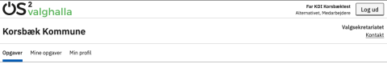
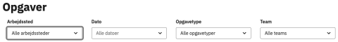
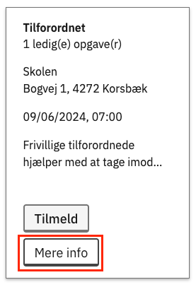

# Forklaring
Menupunktet 'Opgaver' er kun synligt for deltagere som er logget ind og er tilknyttet et team.

Ved hjælp af dette kan deltagere se ledige opgaver fra det eller de teams, som de er medlem af. Deltagere kan benytte filtreringsmuligheder til at afgrænse hvilke opgaver, der vises.

Det er muligt for deltagere at se mere information og tilmelde sig opgaver.

# Betroede opgavetyper vises ikke
Bemærk at betroede opgavetyper aldrig vises på oversigten. Hvis du vil gøre en opgave tilgængelig for alle
teammedlemmer, så rediger opgavetypen, så den ikke er betroet.

### Trin for trin

 

  
<strong>Trin 1: Find 'Opgaver'</strong>

  
Når en deltager er logget ind på den eksterne hjemmeside, bliver menupunktet 'Opgaver' synligt.

  

 

  
<strong>Trin 2: Filtrér på opgaver</strong>

  
Ved at benytte filtrene er det muligt at afgrænse til et udvalg af de tilgængelige opgaver.

  

 

  
<strong>Trin 3: Se mere information</strong>

  <ol>
    <li>Klik på Mere info-knappen på en opgave.</li>
    <li>Nu åbner en ny side med den fulde information om opgaven.</li>
  </ol>
  

 

  
<strong>Trin 4: Tilmeldelse til opgave</strong>

  <ol>
    <li>Tilmeld dig til en opgave ved at klikke på Tilmeld-knappen
      <ol>
        <li>Det kan enten gøres direkte fra opgave-oversigten eller fra siden med mere information om opgaven</li>
      </ol>
    </li>
    <li>Hvis der kommer en besked om, om du vil tilmelde dig, så klik på Bekræft tilmelding-knappen</li>
    <li>Der vises en bekræftelse på, at du er blevet tilmeldt til opgaven</li>
    <li>I visse situationer er det ikke muligt at tilmelde sig en opgave:
      <ol>
        <li>Hvis du allerede er tilmeldt en anden opgave på samme tid</li>
        <li>Hvis valideringen viser, at du ikke bor i den krævede kommune eller er fyldt 18 år på valgdagen</li>
      </ol>
    </li>
    <li>I de tilfælde viser en fejlbesked, hvor du ikke kan tilmelde dig</li>
  </ol>

