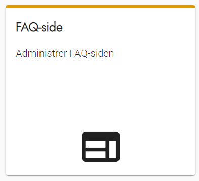
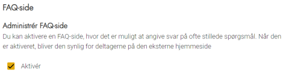
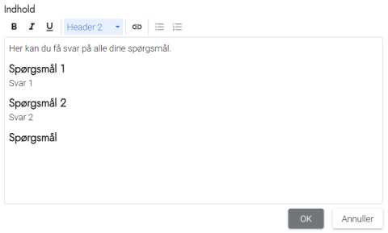

# Forklaring
FAQ-siden er en mulighed for at aktivere et menupunkt på den eksterne hjemmeside, hvor du kan give
deltagerne svar på ofte stillede spørgsmål. Siden vises kun for deltagere, der er logget ind. Det er helt op til
dig, om du vil aktivere siden.

# Webtilgængelighed
Husk at formatere teksten, så den er webtilgængelig. Få eventuelt hjælp fra jeres kommunikationsafdeling
eller en hjemmesideansvarlig, hvis du ikke selv ved, hvad det indebærer.

### Trin for trin

 

  
<strong>Trin 1: Administration af FAQ-side</strong>

  
Fra forsiden skal du:

  <ol>
    <li>Vælge Administration i topmenuen</li>
    <li>Klikke på Ekstern hjemmeside</li>
    <li>Klikke på FAQ-side</li>
  </ol>
  

 

  
<strong>Trin 2: Aktivér FAQ-side</strong>

  
FAQ-siden vises på den eksterne hjemmeside for deltagere, som er logget ind. Den kan slås til og fra, alt efter om du finder behov for den.

  
Når siden skal slås til, skal du sætte et flueben i feltet <strong>Aktivér</strong> og klikke på OK.

  
Når siden skal slås fra, skal du fjerne fluebenet i feltet <strong>Aktivér</strong> og klikke på OK.

  
Når siden er slået til, får deltagerne den som et punkt i deres menulinje.
 
  

 

  
<strong>Trin 3: Indhold</strong>

  
FAQ-sidens indhold styres i en almindelig teksteditor.

  
Det anbefales at have tydelig opdeling mellem de enkelte spørgsmål/svar-emner.

  
Når du har rettet indholdet af din FAQ-side, trykker du <strong>OK</strong>.

  
Er siden aktiveret, vil det nye indhold nu være synligt for deltagerne.
 
  

