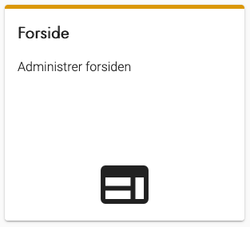
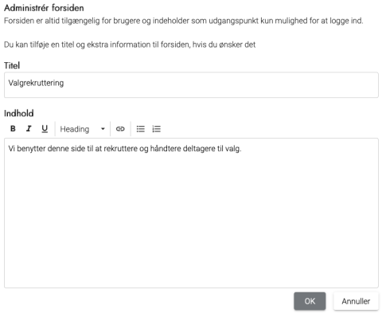

# Forklaring
Forsiden af den eksterne hjemmeside er altid tilgængelig for brugere. Hvis du ikke har aktiveret et valg, vises
en besked om, at kommunen ikke afvikler valg for tiden. Når du aktiverer valg vises som udgangspunkt kun
mulighed for at logge ind.

Du kan tilføje en titel og ekstra information til forsiden, hvis du ønsker det. Det kunne fx være en kort tekst og
et link til forklaring om valgafvikling på kommunens egen hjemmeside.

# Webtilgængelighed
Husk at formatere teksten, så den er webtilgængelig. Få eventuelt hjælp fra jeres kommunikationsafdeling
eller en hjemmesideansvarlig, hvis du ikke selv ved, hvad det indebærer.

### Trin for trin

 

  
<strong>Trin 1: Administration af forside af den eksterne hjemmeside</strong>

  
Fra forsiden af den administrative hjemmeside skal du:

  <ol>
    <li>Vælge Administration i topmenuen</li>
    <li>Klikke på Ekstern hjemmeside</li>
    <li>Klikke på forside</li>
  </ol>
  

 

  
<strong>Trin 2: Redigering af indhold</strong>

  <ol>
    <li>Du kan tilføje en titel og supplere med indhold i teksteditoren</li>
    <li>Tryk på OK, når du har tilføjet den ønskede tekst</li>
    <li>Ændringer slår igennem med det samme på den eksterne hjemmeside</li>
  </ol>
    
  

