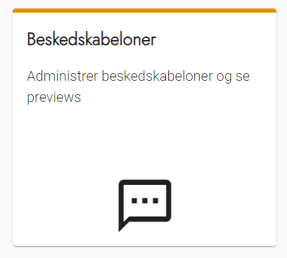
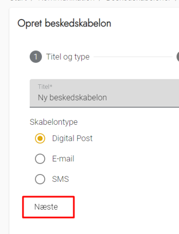
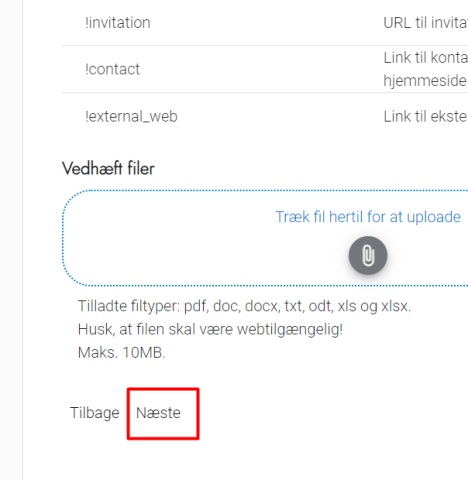
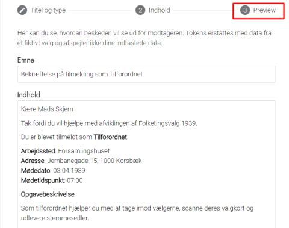
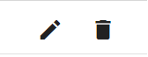
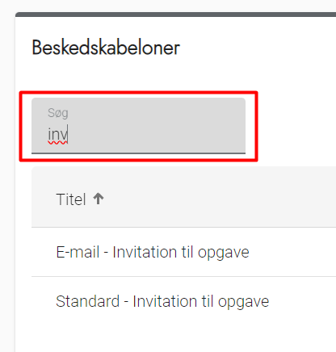
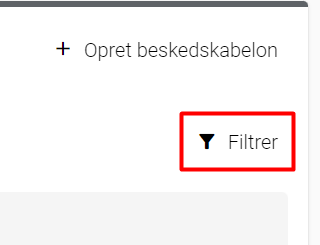

# Forklaring
Beskedskabeloner benyttes til at styre den automatiske kommunikation, som OS2valghalla sender til
deltagerne. Det er fx invitation til en opgave og bekræftelse på en tilmelding.

OS2valghalla kommer med en række standardskabeloner, som ikke kan slettes, fordi de benyttes til at sikre,
at den automatiske kommunikation fungerer som forventet. Du kan dog godt redigere disse skabeloner, så de
passer til jeres kommune.

Du kan også tilføje skabeloner for beskeder, som bruges flere gange til ad hoc udsending - fx beskeder om
evaluering efter valget.

# OBS!
Valghalla anvender fiktive data fra Korsbæk kommune i preview til at udfylde de steder, hvor du har brugt
tokens. Det er altså ikke jeres egne data, der udskiftes med, når du skal se et preview.

### Trin for trin

 

  
<strong>Trin 1: Administration af beskedskabeloner</strong>

  
Fra forsiden skal du:

  <ol>
    <li>Vælge Kommunikation i topmenuen</li>
    <li>Klik på Beskedskabeloner</li>
  </ol>
  

 

  
<strong>Trin 2: Opret beskedskabelon</strong>

  
Når du skal oprette en ny skabelon skal du vælge Opret beskedskabelon øverst til højre

  

    
<strong>Trin 2.1: Titel og type</strong>

    <ol>
      <li>Udfyld titel til internt brug og vælg skabelontypen</li>
      <li>Vælg Næste</li>
    </ol>
     
  

  

    
<strong>Trin 2.2: Udfyld indhold i beskeden</strong>

    
På denne side skal du udfylde indholdet i beskeden, der sendes ud.

    <ol>
      <li>Emne er den tekst, der bliver indsat i fx emnelinjen på e-mails</li>
      <li>
        Indhold udfyldes med selve beskeden
        <ul>
          <li>Vær opmærksom på de muligheder, der er for at flette indhold fra OS2valghalla ind via Token listen under indholdsfeltet.</li>
          <li>Se evt. nogle af de standardskabeloner, der er oprettet i OS2valghalla for inspiration</li>
        </ul>
      </li>
      <li>Vedhæft filer-funktionen kan anvendes til at vedhæfte vejledninger til opgaver eller lign. standardmateriale, der skal udsendes sammen med beskeden.</li>
      <li>Vælg Næste</li>
    </ol>
     
  

  

    
<strong>Trin 2.3: Se hvordan din besked ser ud</strong>

    
<strong>OBS</strong> Valghalla anvender fiktive data fra Korsbæk kommune til at udfylde de steder, hvor du har brugt Tokens.

    
Du kan nu se, hvordan din beskedskabelon ser ud med det indhold, du har udfyldt.

    <ol>
      <li>Hvis du er tilfreds med beskedskabelonen, vælger du OK nederst</li>
      <li>Hvis du ønsker at ændre noget, kan du vælge Tilbage nederst og foretage dine ændringer, inden du godkender</li>
    </ol>
    
Skabelonen kan altid redigeres efterfølgende.

     
  

 

  
<strong>Trin 3: Rediger eller slet beskedskabelon</strong>

  <ol>
    <li>Klik på Skraldespanden for at slette en beskedskabelon</li>
    <li>Klik på Blyanten for at redigere en beskedskabelon</li>
  </ol>
  

 

  
<strong>Trin 4: Søg efter beskedskabelon</strong>

  
Du kan søge på titlen i listen over beskedskabeloner.

  
Listen vil automatisk begynde at afspejle det indhold, du skriver i søgefeltet.

   

 

  
<strong>Trin 5: Filtrer listen</strong>

  
Du kan vælge at filtrere listen efter Skabelontype. Der kan vælges Digital Post, E-mail eller SMS.

  
Du finder filterfunktion over listen med beskedskabeloner i billedets højre side.

  

