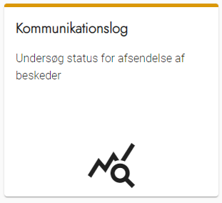
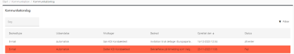
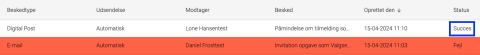

# Forklaring
I kommunikationsloggen kan du se alle beskeder, der er sendt fra OS2valghalla. Det inkluderer både
automatisk og manuelt udsendte beskeder.

Du har også mulighed for at se status på afsendelsen: Det vil sige, om de står i kø til afsendelse, om de er
afsendt succesfuldt eller om der er fejl. Ved at klikke på beskeden kan du se detaljer om den.

### Trin for trin

 

  
<strong>Trin 1: Tilgå kommunikationslog</strong>

  
  
Fra forsiden skal du:

  <ol>
    <li>Vælge Kommunikation i topmenuen</li>
    <li>Klikke på kommunikationslog</li>
  </ol>

  

  
<strong>Trin 2: Brug kommunikationsloggen</strong>

  
  
Kommunikationsloggen er delt op i:

  <ol>
    <li>Overbliksbillede</li>
    <li>Søgefunktion</li>
    <li>Filter</li>
  </ol>

  
Overbliksbilledet indeholder oplysninger om alle forsendelser Valghalla har foretaget. Hver række svarer til en forsendelse – både dem der er lykkes, fejlet og dem som er i kø.

  
<strong>Søgefunktion</strong>

  

  

    
<strong>Trin 2.1: Overbliksbillede</strong>

    
Overbliksbilledet er opdelt i seks kolonner med informationer:

    
<strong>Beskedtype:</strong> Beskriver hvilken kanal der er brugt til den pågældende forsendelse.

    
<strong>Udsendelse:</strong> Beskriver hvorvidt forsendelsen er sket automatisk eller manuelt.

    
<strong>Modtager:</strong> Viser hvem der er modtager af henvendelsen. Ved klik tilgår du deltagerens profil.

    
<strong>Besked:</strong> Viser titlen på forsendelsen.

    
<strong>Oprettet den:</strong> Dato og klokkeslet for oprettelsen.

    
<strong>Status:</strong> Viser om forsendelsen er lykkes, fejlet eller sat i kø. Fejlede vises med rød markering.

  

  

    
<strong>Trin 2.2: Søgefunktion og filter</strong>

    
Både søgefunktion og filter kan hjælpe til at navigere i overbliksbilledet.

    
<strong>Søgefunktionen:</strong> Søger i både modtager- og beskedkolonnen. Du kan finde forsendelser til en specifik modtager eller med samme titel.

    
<strong>Filter:</strong> Kan sortere mellem forsendelser der er lykkes og dem der er fejlet.

  

  
<strong>Trin 3: Se detaljer om en besked</strong>

  
Du kan se alle detaljer om en besked:

  <ol>
    <li>Klik på det ord, der står ud for en besked i kolonnen "Status"
      <ol>
        <li>Ord kan være Succes, Afventer og Fejl</li>
      </ol>
    </li>
  </ol>

  
<strong>Eksempler på fejlbeskeder:</strong>

  <ul>
    <li>Deltager kan ikke modtage Digital Post: <code>"Message":"Participant does not have Digital Post"</code></li>
    <li>Der er ikke oprettet en mailadresse på deltageren: <code>"Message":"Participant does not have email yet"</code></li>
  </ul>

  

