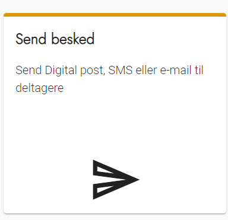
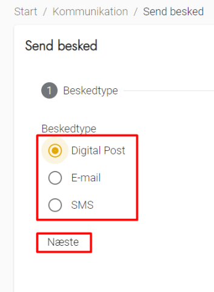
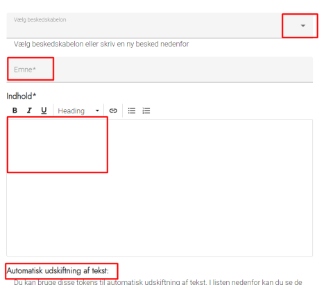
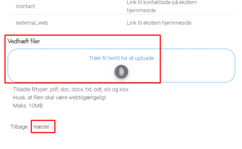
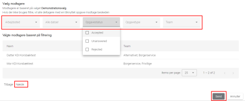
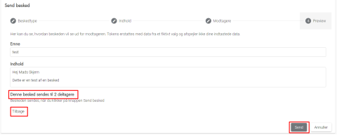

# Forklaring
Du har mulighed for at udsende en besked til en afgrænset gruppe af deltagere via enten Digital Post, e-mail
eller SMS.

Bemærk at de potentielle modtagere er defineret af det valg, som du arbejder med. Beskeder kan kun sendes
til deltagere, som har en tilknyttet opgave i dette valg.

###  Send besked 

Send besked anvendes til at sende beskeder ud over de på forhånd opsatte beskedskabeloner, som udsendes automatisk

Det er muligt at udvælge på en eller flere foruddefinerede lister, hvem beskeden skal sendes til.

### Trin for trin

 

  
<strong>Trin 1: Vælg Send besked</strong>

  
Fra forsiden skal du:

  <ol>
    <li>Vælge Kommunikation i topmenuen</li>
    <li>Klik på Send besked</li>
  </ol>
  

 

  
<strong>Trin 2: Vælg Beskedtype</strong>

  <ol>
    <li>Vælg om beskeden skal sendes som Digital Post, E-mail eller SMS</li>
    <li>Klik på Næste</li>
  </ol>
  

 

  
<strong>Trin 3: Vælg beskedskabelon eller skriv ny besked</strong>

  
På denne side kan du vælge en allerede oprettet Beskedskabelon, eller skrive en ny besked til deltageren du udvælger efterfølgende.

  <ol>
    <li>Hvis du har oprettet en Beskedskabelon, kan du vælge den på valglisten øverst</li>
    <li>Hvis du skal skrive en ny besked:
      <ol>
        <li>Udfyld emne, emne er den tekst der bliver indsat i fx emnelinjen på e-mail</li>
        <li>Skriv din besked i feltet Indhold - husk du kan bruge Tokens vist nederst på siden til at flette oplysninger ind i beskeden</li>
        <li>Du kan vedhæfte filer nederst på siden</li>
      </ol>
    </li>
    <li>Vælg Næste nederst på siden</li>
  </ol>
    
  

 

  
<strong>Trin 4: Vælg modtagere</strong>

  
Du kan nu udvælge de modtagere, der skal have beskeden.

  
Du kan udvælge på de filtre, der vises i oversigten. Vær opmærksom på filtret opgavestatus, så du fx kun sender til de deltagere, der har accepteret en opgave.

  
Når du vælger vil modtagerne af beskeden blive vist i listen nedenunder udvælgelseskriterierne.

  
<strong>OBS!</strong> Hvis du ikke foretager udvælgelse af modtagere, så sendes beskeden til alle deltagere i valget.

  <ol>
    <li>Vælg Næste nederst på siden for at få et preview af beskeden</li>
  </ol>
  

 

  
<strong>Trin 5: Preview og Send besked</strong>

  
Du kan nu se, hvordan din besked ser ud, og hvor mange deltagere beskeden sendes til.

  
<strong>OBS</strong> Valghalla anvender fiktive data fra Korsbæk kommune til at udfylde de steder du har brugt Tokens.

  <ol>
    <li>Vælg Tilbage for at gå tilbage og ændre i din besked</li>
    <li>Vælg Send for at sende beskeden til de valgte modtagere</li>
  </ol>
  

