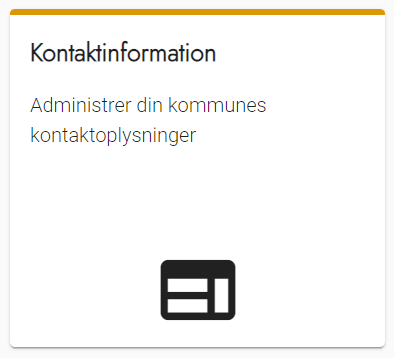
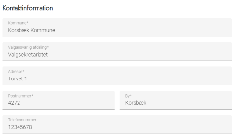
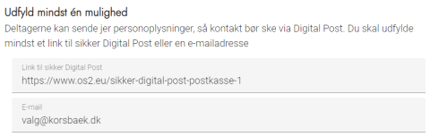
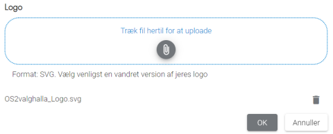

# Forklaring
Den information du angiver under Kontaktinformation, vises flere steder på den eksterne hjemmeside:
- På en dedikeret kontaktside
- I topmenuen
- I bunden af alle sider i en såkaldt footer

### Trin for trin

 

  
<strong>Trin 1: Administration af kontaktinformation</strong>

  
Fra forsiden skal du:

  <ol>
    <li>Vælge Administration i topmenuen</li>
    <li>Klikke på Ekstern hjemmeside</li>
    <li>Klikke på Kontaktinformation</li>
  </ol>
  
Du står nu på siden administration af kontaktinformation.
 
  

 

  
<strong>Trin 2: Kontaktinformation</strong>

  
Du skal først opsætte kommunens kontaktoplysninger:

  <ul>
    <li>Kommunenavn</li>
    <li>Valgansvarlig afdeling</li>
    <li>Adresse</li>
    <li>Postnummer</li>
    <li>By</li>
    <li>Evt. telefonnummer</li>
  </ul>
  

 

  
<strong>Trin 3: Digital kommunikation</strong>

  
Dernæst skal du opsætte muligheder for digital kommunikation til den valgansvarlige afdeling.

  
Du skal opsætte mindst en af enten Digital post eller E-mail.

  <h4>Særligt om Digital Post</h4>
  
Fra koordinationsgruppens side opfordrer vi til, at man opsætter en dedikeret postkasse til at modtage Digital Post fra OS2valghalla. På den måde sikres det, at personoplysninger håndteres korrekt, hvilket kan være særligt relevant, når partitilhørsforhold kan indgå i kommunikationen med borgerne. Hvis du ikke selv administrerer Digital Post, skal du kontakte din IT-afdeling.
 
  

 

  
<strong>Trin 4: Logo</strong>

  
Til sidst skal du opsætte din kommunes logo.

  
Logoet bliver vist flere steder på den eksterne hjemmeside og bruges som knap til at returnere til forsiden.

  
Du kan enten klikke på feltet og gennemse din pc efter logo-filen eller trække den hen på feltet.

  <h4>Særligt om logo</h4>
  
Bemærk at der er krav om, at I leverer logoet i formatet SVG. Det skyldes et ønske om, at den eksterne hjemmeside fungerer lige godt på mobil og computer. Hvis du ikke umiddelbart har adgang til kommunens logo som svg-fil, skal du kontakte kommunens kommunikationsafdeling.
 
  

