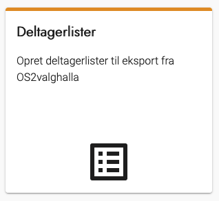
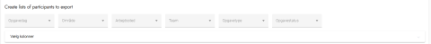
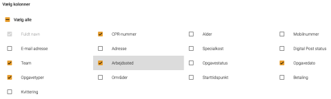
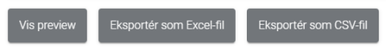

# Forklaring
Ved hjælp af lister kan du eksportere oplysninger om deltagere, opgaver, arbejdssteder mv. Det kan fx være
en fil, som skal benyttes til at informere økonomiafdelingen om, hvor meget de enkelte deltagere skal modtage
i betaling. Eller en liste til at printe og benytte til at få kvitteringer for tilstedeværelse på valgdagen.

### Trin for trin

 

  
<strong>Trin 1: Tilgå lister</strong>

  
Fra forsiden skal du:

  <ol>
    <li>Vælge Lister i topmenuen</li>
    <li>Klikke på Deltagerlister</li>
  </ol>
  

 

  
<strong>Trin 2: Filter</strong>

  
I filteret kan du opsætte den liste, du ønsker at trække.

  
Filteret er opdelt i emner, hvor du i hver emne kan vælge et eller flere punkter.

  
Emnerne er:

  <ul>
    <li>Opgavedag</li>
    <li>Område</li>
    <li>Arbejdssted</li>
    <li>Team</li>
    <li>Opgavetype</li>
    <li>Opgavestatus</li>
  </ul>
  

 

  
<strong>Trin 3: Vælg kolonner</strong>

  <ol>
    <li>Klik på Vælg kolonner</li>
    <li>Vælg de kolonner, du gerne vil have med på listen</li>
  </ol>
  

 

  
<strong>Trin 4: Visning og eksport</strong>

  
Når du har opsat både filtre og kolonner, kan du vise et preview af listen eller eksportere den som Excel- eller CSV-fil.
 
  

