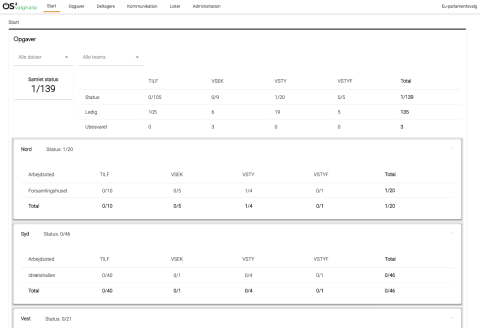
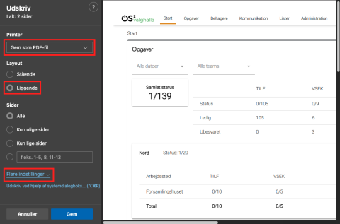
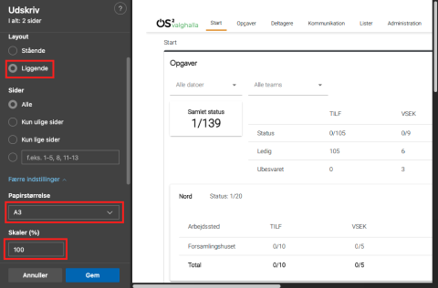

Hvis du har behov for at dele fordelingen af opgaver med en kollega, der ikke har adgang til OS2valghalla, så
kan det lade sig gøre ved at printe oversigten over opgaver som PDF.

**NB**: Denne guide er lavet til Microsoft Edge.

Det er også muligt at printe hele oversigten som PDF fra Chrome.

Desværre fungerer det ikke i Firefox.

  
<strong>Trin 1: Gå til oversigten over opgaver</strong>

  <ol>
    <li>Vælg menupunktet Opgaver</li>
    <li>Klik på Oversigt over opgaver</li>
  </ol>
  

 

  
<strong>Trin 2: Print side som PDF</strong>

  <ol>
    <li>Udskriv siden
      <ol>
        <li>Vælg menupunktet Fil i Edge og derefter Udskriv (eller genvej: Ctrl+p)</li>
      </ol>
    </li>
    <li>I den dialog, der dukker op, skal du vælge:
      <ol>
        <li>Printer: Gem som PDF-fil</li>
        <li>Layout: Liggende</li>
      </ol>
    </li>
    <li>Klik på "Flere indstillinger" og vælg:
      <ol>
        <li>Papirstørrelse: A3</li>
      </ol>
    </li>
    <li>Herefter skal du benytte Skaler (%) til at justere størrelsen, så hele tabellen kommer med
      <ol>
        <li>Benyt forhåndsvisningen af printet til højre på skærmen til at finde det rigtige tal</li>
      </ol>
    </li>
    <li>Klik på Gem</li>
    <li>Vælg hvor filen skal gemmes</li>
  </ol>
    
  

 

  
<strong>Trin 3: Tjek at hele oversigten er med</strong>

  <ol>
    <li>Find og åbn PDF-filen for at tjekke at hele oversigten er kommet med</li>
    <li>Hvis der mangler noget, kan du printe en ny PDF-fil, hvor du sætter skaleringen til et mindre tal</li>
  </ol>
  

