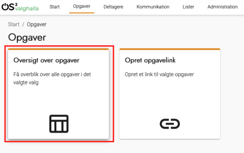
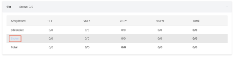
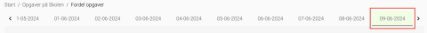
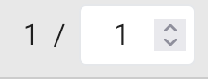

# Forklaring
Det er på de enkelte arbejdssteder du definerer, hvilke opgaver der skal løses af hvem.

Opgaver er altid tilknyttet et valg, et team og en dato.

Det er i [administrationen af et arbejdssted](../administration/arbejdssteder), du definerer hvilke opgavetyper og teams, der er relevante.

Det er i [administrationen af et valg](../administration/valg), du definerer hvilke arbejdssteder, der er relevante.

### Trin for trin

 

  
<strong>Trin 1: Vælg Opgaveoverblik eller Start</strong>

  
Sørg først for at du har valgt det valg, som du skal fordele opgaver i.

  
Gå dernæst til opgaveoversigten:

  <ol>
    <li>Vælg Opgaver i topmenuen</li>
    <li>Vælg Oversigt over opgaver</li>
  </ol>
  
Eller tryk på Start i topmenuen

  

 

  
<strong>Trin 2: Vælg arbejdssted</strong>

  <ol>
    <li>Klik på det arbejdssted, du vil fordele opgaver på</li>
  </ol>
  
Nu vises en oversigt over de teams og opgavetyper, som du har defineret som relevante for dette arbejdssted.

  

 

  
<strong>Trin 3: Fordel opgaver</strong>

  <ol>
    <li>Klik på Fordel opgaver-knappen i øverste højre hjørne</li>
    <li>Bemærk den øverste række af datoer, hvor valgdatoen er markeret med grønt
      <ol>
        <li>Rækken af datoer er bestemt af det datointerval, som er defineret på valget</li>
      </ol>
    </li>
    <li>Vælg den dato, hvor du vil fordele opgaver</li>
    <li>Indtast antallet af de forskellige opgavetyper ud for de enkelte teams for at fordele opgaverne</li>
    <li>Vælg en ny dato og fordel flere opgaver, hvis nødvendigt</li>
    <li>Klik på Gem</li>
  </ol>
    
  

 

  
<strong>Trin 4: Rediger fordelingen af opgaver</strong>

  <ol>
    <li>Klik på Fordel opgaver-knappen i øverste højre hjørne</li>
    <li>Sørg for at du vælger den ønskede dato i den øverste række af datoer</li>
    <li>Ændr antallet af de forskellige opgavetyper ud for de enkelte teams for at redigere fordelingen</li>
    <li>Bemærk at du ikke kan fjerne opgaver, som allerede er tildelt en deltager
      <ol>
        <li>Du kan se antallet af tildelte opgaver på det tal, som ikke kan ændres</li>
      </ol>
    </li>
    <li>Klik på Gem</li>
  </ol>
  

