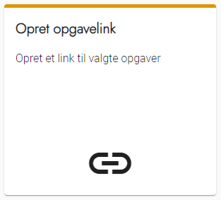
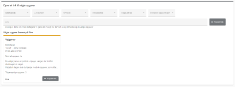

# Forklaring
Ved hjælp af dette værktøj kan du oprette et særligt link til den [eksterne hjemmeside](../ekstern_hjemmeside/index), som kun viser de opgaver, du ønsker at gøre tilgængelige. Via linket bliver det muligt for deltagere selv at vælge mellem opgaverne og tilmelde sig.

Opgaverne kan afgrænses ved hjælp af filtre, så du kan lave forskellige links til forskellige formål. Fx et link til alle opgaver, der er tildelt til et enkelt parti. Det kan sendes til partisekretæren, der derefter kan dele mellem partiets medlemmer.

Det kunne også være et link til alle opgaver tildelt teamet "Frivillige", som ikke er tildelt til partier. Det kunne deles på jeres hjemmeside, så alle borgere uden partitilknytning har mulighed for selv at tilmelde sig.

### Bemærk at:
- Alle vil kunne se opgaverne på linket uden at logge ind først
- Opgaverne er altid knyttet til et enkelt team. Det skyldes, at deltagerne tilknyttes dette team, hvis de tilmelder sig til en af opgaverne
- Du har mulighed for at inkludere betroede opgaver i linket, så vær varsom med, hvor sådan et link
deles
- Når en opgave er tildelt en deltager, forsvinder den fra oversigten på linket

  
<strong>Trin 1: Opret opgavelink</strong>

  
Fra forsiden skal du:

  <ol>
    <li>Vælge Opgaver i topmenuen</li>
    <li>Klikke på Opret opgavelink</li>
  </ol>
  

 

  
<strong>Trin 2: Konfigurer dit link</strong>

  
Du konfigurerer det link, du skal bruge, ved at benytte de forskellige drop-down menuer.

  
Der er seks kolonner / parametre, som du kan bruge til at konfigurere dit link:

  <ol>
    <li><strong>Team:</strong> Filtrerer mellem de forskellige teams, du har opsat</li>
    <li><strong>Dato:</strong> Filtrerer på dato for opgaven</li>
    <li><strong>Område:</strong> Filtrerer på områder (hvis dette benyttes)</li>
    <li><strong>Arbejdssted:</strong> Filtrerer på arbejdssteder</li>
    <li><strong>Opgavetype:</strong> Filtrerer på typer af opgaver</li>
    <li><strong>Betroet opgave:</strong> Filtrerer på, hvorvidt opgaven er betroet eller ej (opsættes under den enkelte opgavetype)</li>
  </ol>
  
Efterhånden som du justerer de forskellige parametre, vil billedet vise, hvilket resultat modtagerne vil se.

  
Når du har konfigureret linket, kan du kopiere linket til højre for filteret.

  
Det er også muligt at kopiere et direkte link til den enkelte opgave, såfremt modtageren kun skal kunne se denne ene opgave.

  

