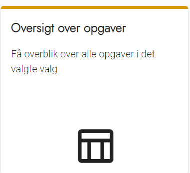
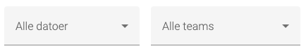

# Forklaring
Oversigten over opgaver er det primære værktøj under afviklingen af valget. Her kan du løbende se status på tilmeldingerne. Det er også herfra, du får adgang til at fordele opgaver på arbejdsstederne og invitere deltagere til opgaver.

Bemærk at oversigten er knyttet til det valg, du aktivt arbejder med.

Bemærk at du som udgangspunkt ser status for alle datoer og alle teams, men du har mulighed for at
afgrænse til en enkelt dato eller et enkelt team.

---

I oversigten over opgaver har du mulighed for at danne dig et overblik over processen med at finde deltager til opgaverne, der er opsat til valget.

### Trin for trin

 

  
<strong>Trin 1: Vælg Opgaveoverblik eller Start</strong>

  <ol>
    <li>Vælg Opgaver i topmenuen</li>
    <li>Vælg Oversigt over opgaver</li>
  </ol>
  
Eller tryk på Start i topmenuen
 
  

 

  
<strong>Trin 2: Filtrér på Teams og Datoer</strong>

  
Det er muligt at filtrere på både Teams og Datoer, så du kan se overblikket på bestemte datoer og/eller for et bestemt team.
 
  

 

  
<strong>Trin 3: Farvekoder</strong>

  <ul>
    <li>Gul: Der afventes svar på en invitation til mindst en opgave</li>
    <li>Grøn: Alle opgaver er accepterede af deltagere</li>
  </ul>

 

  
<strong>Trin 4: Se status på et arbejdssted</strong>

  <ol>
    <li>Klik på et arbejdssted for at se status på dette</li>
    <li>Se vejledning til <a href="fordeling_opgaver_arbejdssted" alt="Vejledning til fordeling af opgaver">fordeling af opgaver på et arbejdssted</a></li>
  </ol>

