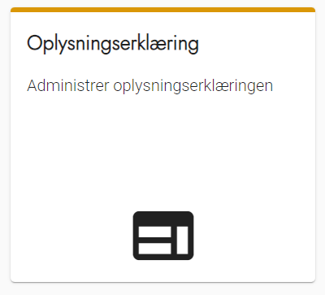
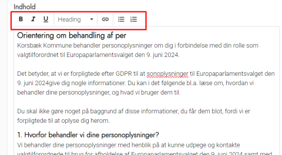
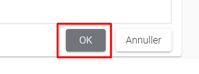

# Forklaring
Alle deltagere får vist oplysningserklæringen, når de opretter en bruger. Den forklarer deltagerne, hvordan kommunen har lovhjemmel til at behandle deres personoplysninger for at gennemføre det aktuelle valg. Det er kommunens egen opgave at lave en oplysningserklæring.

Oplysningserklæringen kan også ses ved at benytte linket til privatlivspolitik i bunden af den eksterne hjemmeside.

Se et eksempel på "Korsbæk Kommunes" oplysningserklæring, som er baseret på Odense Kommunes
udgave:
[Download word-fil](../documents/Oplysningserklaering%20-%20Korsbaek%20Kommune.docx)

Hvis I ønsker at bruge deltagernes personlige oplysninger til andet end afvikling af det aktuelle valg, skal I indhente deres samtykke. Dette gøres ved at aktivere [samtykkeerklæringen](samtykkeerklaering).

# Webtilgængelighed
Husk at formatere teksten, så den er webtilgængelig. Få eventuelt hjælp fra jeres kommunikationsafdeling eller en hjemmesideansvarlig, hvis du ikke selv ved, hvad det indebærer.

### Trin for trin

 

  
<strong>Trin 1: Administration af Oplysningserklæring</strong>

  
Fra forsiden skal du:

  <ol>
    <li>Vælge Administration i topmenuen</li>
    <li>Klikke på Ekstern hjemmeside</li>
    <li>Klikke på Oplysningserklæring</li>
  </ol>
   
  
Du står nu på siden administration af oplysningserklæring.

  

 

  
<strong>Trin 2: Rediger indhold i Oplysningserklæring</strong>

  
Hver kommune har typisk nogle særlige oplysninger om fx DPO, der skal indgå i kommunens oplysningserklæring.

  
Du kan derfor redigere og ændre indholdet i løsningens oplysningserklæring, så den passer til din kommune.

  
Rediger teksten og brug de muligheder for formatering, som siden indeholder, og tryk OK, når du er færdig.

    
  

