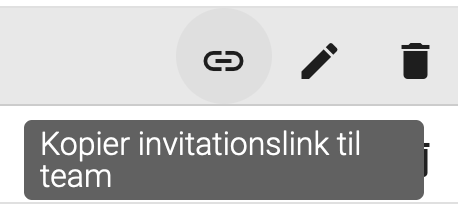
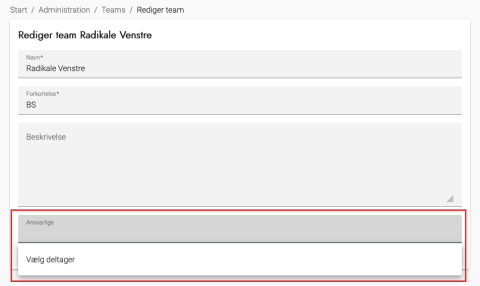

Mange samarbejder med partisekretærerne om at fordele et parti/teams tildelte opgaver. For at det kan lade sig gøre, skal partisekretæren være oprettet som deltager og have tildelt rettigheden som teamansvarlig.

En teamansvarlig har rettigheder til at:
- Invitere deltagere til at blive medlem af teamet
- Se oversigt over teammedlemmer
- Fjerne teammedlemmer
  - Dette kan blokeres, hvis man øger låseperioden før en opgave skal løses
- Se alle teamets opgaver og status på tilmelding
- Se detaljer om opgaver
- Finde links til specifikke opgaver

# Du kender ikke partisekretærens CPR-nummer 

Hvis du ikke kender partisekretærernes CPR-nummer, kan du invitere dem til at oprette sig selv i systemet, og derefter tildele dem rettigheden som teamansvarlig for det relevante team.

  
<strong>Trin 1: Skaf invitationslink til et team</strong>

  
Det er muligt at invitere nye deltagere til et team. Via et link kan de selv oprette sig, og så bliver de automatisk tilknyttet teamet.

  
Du kan finde invitationslinket i den administrative hjemmeside ved at følge denne guide:

  <ol>
    <li>Klik på menupunktet Administration</li>
    <li>Klik på Teams</li>
    <li>Find det team, som partisekretæren skal være teamansvarlig for, og klik på link-ikonet</li>
    <li>I den dialog, der åbner, skal du klikke på Kopier link til teamet-knappen</li>
    <li>Invitationslinket er nu gemt i din udklipsholder</li>
  </ol>
  

 

  
<strong>Trin 2: Del invitationslinket med partisekretær</strong>

  <ol>
    <li><a href="administration/valg">Aktiver et valg</a>, så den eksterne hjemmesides funktioner aktiveres</li>
    <li>Send invitationslinket til teamet til partisekretæren</li>
    <li>Bed dem om at benytte det til at oprette en profil og give dig besked, når det er gjort</li>
  </ol>

 

  
<strong>Trin 3: Tildel rettighed som teamansvarlig</strong>

  <ol>
    <li>Gå til menupunktet Administration og klik på Teams</li>
    <li>Rediger det team, som partisekretæren tilhører</li>
    <li>Tilføj partisekretæren som ansvarlig</li>
    <li>Klik på OK</li>
  </ol>
  

 

  
<strong>Trin 4: Informér partisekretæren</strong>

  
Send linket til den eksterne hjemmeside (fx <a href="https://korsbaek.os2valghalla.dk">https://korsbaek.os2valghalla.dk</a>) til partisekretæren og giv besked om, at der efter login nu er kommet mulighed for at administrere partiets opgaver.

  
Find inspiration til en <a href="ekstern_hjemmeside/vejledning_til_partisekretaerer">vejledning til partisekretærer</a>.

 

# Du kender partisekretærens CPR-nummer 

Hvis du kender partisekretærens CPR-nummer, kan du benytte det til at oprette en deltager og derefter tildele rettigheden som teamansvarlig for det relevante team.