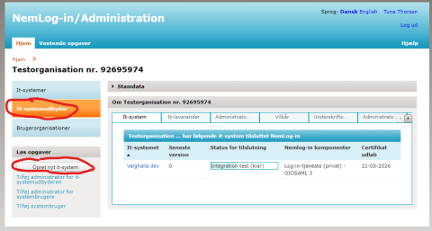
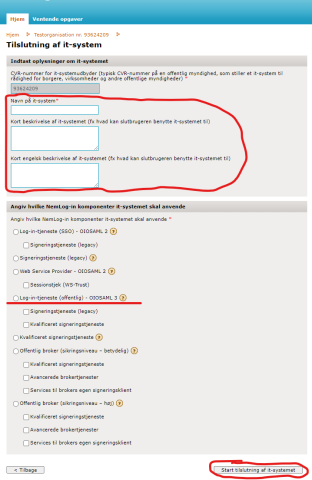
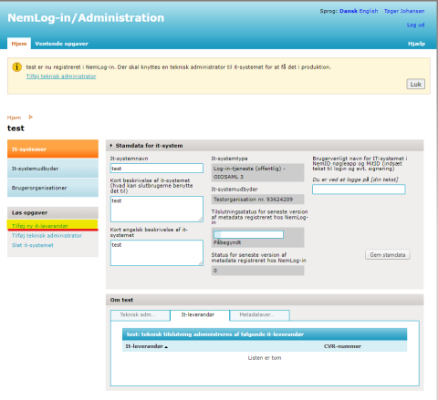
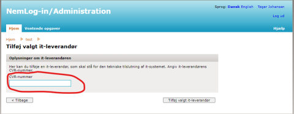
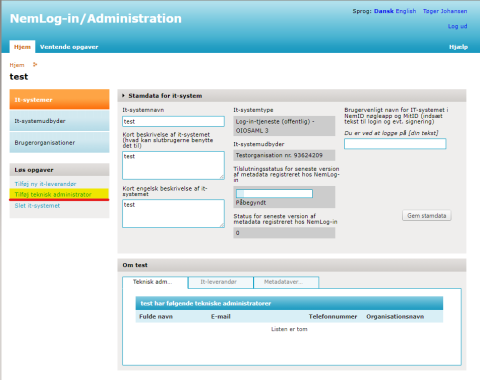
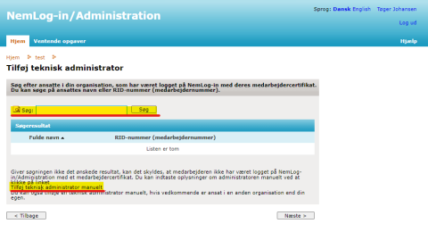
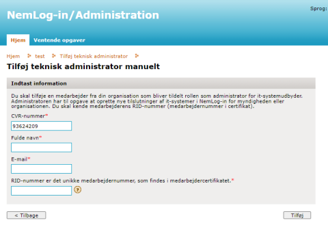

Kommunen skal registrere OS2valghalla i portalen NemLog-In Administration, så deltagere kan logge ind i den eksterne hjemmeside med MitID.

Kommunen skal i denne forbindelse forbindelse have en NSIS-vurdering af sikkerhedsniveau. OS2 har i samarbejde med Københavns Kommune udarbejdet [dette skema](https://boks.os2.eu/s/BtgnZW9R8B5rSt9) med vurderingen, som I bør downloade og gemme.

Bemærk at denne registrering er nødvendig, selvom Fælleskommunal Adgangsstyring/KOMBIT Context Handler 2 er opsat.

##  Guide til oprettelse af OS2valghalla 

En medarbejder med adgang til [NemLog-In Administration](https://administration.nemlog-in.dk/) kan følge denne guide for at oprette OS2valghalla som NemLog-in system

  
<strong>Trin 1: Log ind</strong>

  
Log ind i administrationsmodulet for NemLog-in: <a href="https://administration.nemlog-in.dk/">https://administration.nemlog-in.dk/</a>

 

  
<strong>Trin 2: Opret et IT system</strong>

  <ol>
    <li>Klik på IT-systemudbyder</li>
    <li>Klik på Opret nyt it-system</li>
  </ol>
  

 

  
<strong>Trin 3: Indtast oplysninger</strong>

  
<strong>OBS!</strong> [kommune] er kommunenavnet, f.eks. København eller Holbæk. Det skal være formateret, så det ikke indeholder æøå, eksempelvis “koebenhavn” eller “holbaek” ligesom i URL’en til applikationen.

  <ul>
    <li><strong>Navn</strong>: [kommune]-OS2valghalla-Prod</li>
    <li><strong>Dansk beskrivelse</strong>: OS2valghalla er et valgplanlægningssystem til opgaver omkring et valg. Borgere kan melde sig som frivillige og skal logge ind med MitID for at administrere egne opgaver.</li>
    <li><strong>Engelsk beskrivelse</strong>: OS2valghalla is an election planning system with different tasks for elections. Citizens can volunteer and they need to log in with MitID to administer their own tasks.</li>
    <li>Vælg <strong>Log-in tjeneste (Offentlig) – OIOSAML 3</strong></li>
  </ul>
  
Når alt er udfyldt klik <strong>Start tilslutning af it-systemet</strong>.
 
  

 

  
<strong>Trin 4: Vælg IT-leverandør</strong>

  
På det næste skærmbillede kan der vælges en IT-leverandør i venstremenuen:

  <ol>
    <li>Klik på <strong>Tilføj ny it-leverandør</strong>
      <ol>
        <li><strong>Navn</strong>: Foreningen OS2 - Offentligt digitaliseringsfællesskab</li>
        <li><strong>CVR</strong>: 41849983</li>
      </ol>
    </li>
    <li>Indtast CVR nummer og <strong>Tilføj valgt IT-leverandør</strong></li>
  </ol>
  
Når it-leverandøren er tilføjet kan man gå videre til det næste skridt.

    
  

 

  
<strong>Trin 5: Tilføj teknisk administrator</strong>

  <ol>
    <li>På it-system oversigtssiden vælges <strong>Tilføj teknisk administrator</strong></li>
    <li>Der enten søges efter brugere, eller de kan oprettes manuelt
      <ol>
        <li>Som regel skal de oprettes manuelt</li>
      </ol>
    </li>
    <li>Manuel oprettelse af teknisk administrator(e) med følgende oplysninger:
      <ol>
        <li><strong>Navn</strong>: Dany Abdelke</li>
        <li><strong>E-mail</strong>: <a href="mailto:dany.abdelke@preciofishbone.se">dany.abdelke@preciofishbone.se</a></li>
      </ol>
    </li>
    <li>RID-numre fremsendes til systemopretter på opfordring
      <ol>
        <li>Systemopretter sender en mail til Dany, som fremsender begge RID-numre</li>
      </ol>
    </li>
  </ol>
  
Klik <strong>Tilføj</strong> når informationerne er udfyldt. 
  Gentag processen for hver teknisk administrator, der skal tilføjes.

  
Nu skulle det være muligt for Precio Fishbone at arbejde videre med registreringen, til den er færdig, og systemet er overført til produktion.

    
    
  

