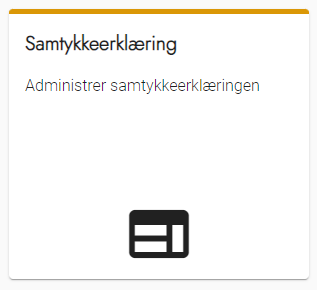

# Forklaring
Alle deltagere bliver vist oplysningserklæringen, når de opretter en bruger.

Hvis du ønsker at behandle deltagernes personoplysninger udover til at gennemføre det nuværende valg, kan det være nødvendigt at indhente deres samtykke. Hvis I fx gerne vil kunne kontakte deltagerne igen ved næste valg, skal I have deres samtykke til det.

Hvis du indsætter en samtykkeerklæring og aktiverer den, skal deltagerne aktivt give deres samtykke til den indsatte tekst, når de opretter en bruger.

# Webtilgængelighed
Husk at formatere teksten, så den er webtilgængelig. Få eventuelt hjælp fra jeres kommunikationsafdeling eller en hjemmesideansvarlig, hvis du ikke selv ved, hvad det indebærer.

### Trin for trin

 

  
<strong>Trin 1: Administration af Samtykkeerklæring</strong>

  
Fra forsiden skal du:

  <ol>
    <li>Vælge Administration i topmenuen</li>
    <li>Klikke på Ekstern Hjemmeside</li>
    <li>Klikke på Samtykkeerklæring</li>
  </ol>
  
Du står nu på siden administration af samtykkeerklæring.

  

 

  
<strong>Trin 2: Aktivér Samtykkeerklæring</strong>

  
Når siden skal slås til, skal du sætte et flueben i feltet <strong>Aktivér</strong> og klikke OK.

  
Når siden skal slås fra, skal du fjerne fluebenet i feltet <strong>Aktivér</strong> og klikke OK.

  
Når siden er slået til, vil deltagerne blive mødt af et krav om at godkende samtykkeerklæring ved oprettelse af deres konto.
 
  

 

  
<strong>Trin 3: Indhold</strong>

  
Indholdet af samtykkeerklæringen redigeres i en simpel teksteditor.

  
Da den skal indgå som en del af oprettelsesforløbet, er det ikke muligt at lave formatering.
 
  

